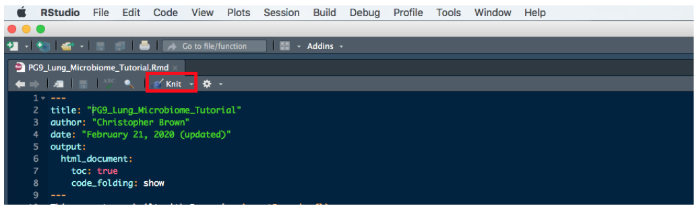

ATS2020\_PG9
============

This is a guide for acquiring the course materials for ATS 2020 PG9: A HANDS-ON INTRODUCTION TO STUDYING THE LUNG MICROBIOME

Pre-course preparation
======================

Prior to starting the section entitled Hands-On: A Crash Course in Microbiome Analysis: Part 1 several pieces of software need to be acquired. Completing these first three steps is required in order to be able to follow along during the live hands-on presentation. It should take between 15-30 minutes to complete these preparatory tasks.

I. R
----

First you'll need to acquire R itself. This can be done directly from [CRAN](https://cran.r-project.org/). If R is already installed, we recommend updating to the current version. You can check your R verison with `getRversion()`.

II. RStudio
-----------

Secondly, install the free desktop version of [RStudio](https://rstudio.com/products/rstudio/download/#download). We also recommend updating RStudio if a prior installation exists.

III. Course Materials
---------------------

Next, the course materials need to be acquired and loaded. First, locate the green **Clone or download** button at the top right of this page, then download the ZIP contents. From your Downloads folder, extract the files from **ATS2020\_PG9-master.zip**. We recommend moving this unzipped/extracted directory either to your desktop or preferred workspace. You will need to navigate to this extracted directory in the next step.

Next, launch RStudio. Then create a new project, by clicking **File &gt; New Project**, in the upper left of the RStudio interface. Click on **Existing Directory** and then browse to find the **ATS2020\_PG9-master** directory that was extracted. Finally, left click the file entitled **PG9\_Lung\_Microbiome\_Tutorial.Rmd** from the lower right pane in the RStudio inferface.

This extracted directory includes all of the data and code necessary to follow along during the hands-on session, though the only file you'll need to directly interact with is **PG9\_Lung\_Microbiome\_Tutorial.Rmd**. Completing these first three steps is required in order to be able to follow along with the hands-on presentation. It should take between 15-30 minutes to complete these tasks.

If you wish to explore at your own pace, you can review the code and run it chunk by chunk, or create the report for a more guided experience (see Step V. below).

IV. Introduction to R (optional: 90-120 minutes)
------------------------------------------------

It would also be highly beneficial to be familiar with the basics of R programming prior to participating in the course, though it is not required. A great resource is [R for Data Science](https://r4ds.had.co.nz/). Reading chapters 1 through 5 will familiarize you with the R design philosophy and syntax you'll see during the hands-on presentation.

V. Knit the Tutorial (optional: &lt; 5 minutes)
-----------------------------------------------

Finally, the .Rmd filed included with these course materials can be assembled into an html report by cliking the Knit button inside RStudio.

