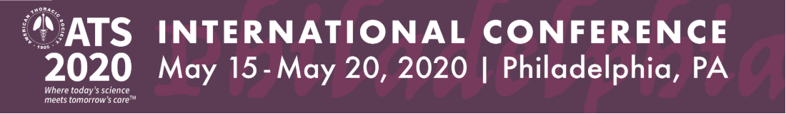

ATS2020\_PG9
============

This is a guide for acquiring the course materials for ATS 2020 PG9: A HANDS-ON INTRODUCTION TO STUDYING THE LUNG MICROBIOME

Pre-course preparation
======================

Prior to starting the section entitled Hands-On: A Crash Course in Microbiome Analysis: Part 1 several pieces of software need to be acquired. Completing these first three steps is required in order to be able to follow along during the live hands-on presentation. It should take between 15-30 minutes to complete these preparatory tasks.

I. R
----

First you'll need to acquire R itself. This can be done directly from [CRAN](https://cran.r-project.org/). If R is already installed, we recommend updating to the current version. You can check your R verison with 3.6.0.

II. RStudio
-----------

Secondly, install the free desktop version of [RStudio](https://rstudio.com/products/rstudio/download/#download). We also recommend updating RStudio if a prior installation exists.

III. Course Package
-------------------

Finally, the course package needs to be installed. To do this, open RStudio then copy, paste the following R code into the console, and then enter the code to execute it.

First, install the devtools package if needed, then load it:

    if (!require(devtools)) install.packages("devtools")
    library(devtools)

Next, install and load the course package.

    install_github("https://github.com/cb-42/NAME_TBD")  
    library(NAME_TBD)

This package includes all of the data and code necessary to follow along during the hands-on session.

Completing these first three steps is required in order to be able to follow along with the hands-on presentation. It should take between 15-30 minutes to complete these tasks.

IV. Introduction to R (optional: 90-120 minutes)
------------------------------------------------

It would also be highly beneficial to be familiar with the basics of R programming prior to participating in the course, though it is not required. A great resource is [R for Data Science](https://r4ds.had.co.nz/). Reading chapters 1 through 5 will familiarize you with the R design philosophy and syntax you'll see during the hands-on presentation.

V. Knit the Tutorial (optional: &lt; 5 minutes)
-----------------------------------------------

Finally, the .Rmd filed included with this course package can be assembled into an html report by cliking the Knit button inside RStudio.

